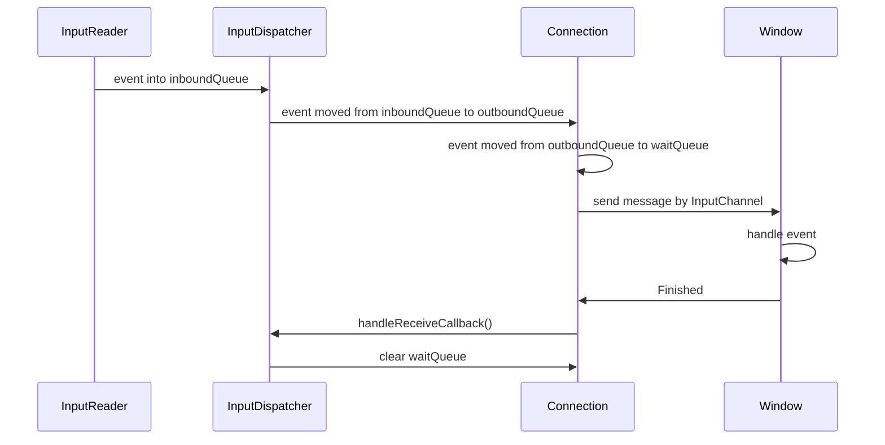

# ARN原理解析

## 简介
ANR(Application Not Responding)，即应用程序无响应，是Android系统用于监控应用程序响应能力的一种机制。

ANR的监控主要是由system_server进程执行，它会监控3种类型的ANR：Broadcast、Service、InputEvent，主要原理是利用消息调度和超时检测来发现ANR，同时进行相关日志记录和告警。

## ANR检测机制

### InputEvent超时检测
InputEvent默认的超时是5秒，如果应用进程在5秒内还未处理完输入事件，则会触发ANR。

#### 1.派发流程

InputEvent由InputDispatcher进行派发，当系统读取到输入事件时会将事件加工后放入InputDispatcher的inboundQueue队列中，InputDispatcher运行在一个独立的线程InputDispatcherThread中循环处理队列里的输入事件进行派发。

Window通过向InputDispatcher注册InputChannel来接收事件，然后InputDispatcher会将InputChannel封装成Connection来与Window进行通信，这里Connection会维护两个队列outboundQueue和waitQueue，同时监听InputChannel的可读性事件。

当Dispatcher进行事件派发时，会从inboundQueue中取出事件并找到目标Connection，然后将事件加工成DispatchEntry放入Connection的outbound队列中，再循环从outboundQueue中取出事件通过InputChannel发送给目标Window，并放入waitQueue中。

当Window收到输入事件后，会通过InputChannel向InputDispatcher发送一个FinishedSignal通知，然后会回调到handleReceiveCallback，InputDispatcher就会将成功派发的事件从waitQueue中中移除，然后开启新一轮的数据派发。

#### 2.超时检测
在InputEvent派发流程中，需要先找到目标的Window然后再进行派发，在找到目标Window的时候就会检查Window是否能够处理新事件，如果需要等待则会调用handleTargetsNotReadyLocked()判断是否等待超时。

如果检测到等待超时后，会通过NativeInputManager将超时通知到InputManagerService，InputManagerService再将超时通知到ActivityManagerService处理。

ActivityManagerService会根据当前Window进程的状态来决定是否报告ANR，同时反馈InputDispatcher继续等待还是放弃新事件的分发。

### Service超时检测
Service处于前台时超时时间是20秒，处于后台时超时时间是200秒，当AMS启动Service时超时时间内未响应则触发ANR。

当AMS启动Service时会通过MainHandler发送一个定时消息，当Service被启动并在onStartCommand方法返回后就会通知AMS已完成执行，AMS就会清除此前发送的定时任务。

如果定时任务未在超时时间内被清除，则定时任务会被执行，此时就会触发ANR的报告。

### Broadcast超时检测
Broadcast默认超时时间是10秒，当AMS向BroadcastReceiver分发广播时超时时间内未完成处理则触发ANR。

AMS维护这两个广播队列分别为前台队列和后台队列，前台队列超时时间10秒，后台队列超时时间60秒，AMS通过广播队列进行广播分发，广播队列在分发串行广播时会通过MainHandler发送一个定时消息，当串行广播接收器处理完毕后会通知AMS已完成，AMS会清除掉定时任务，如果超时时间内未处理完成，则会触发定时任务支持从而报告ANR。

