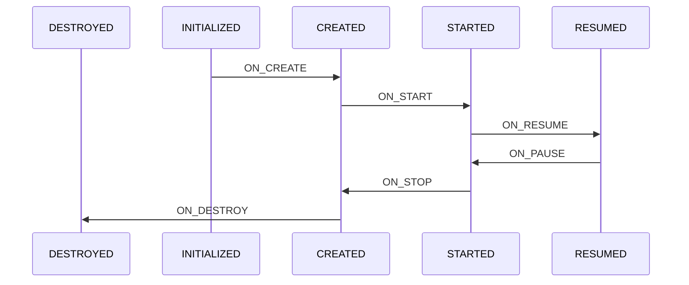

# Android Lifecycle学习笔记

## 简介
Android Lifecycle是Jetpack开发套件中一个监听组件生命周期的框架，它由几个部分构成，包括：Lifecycle、LifecycleObserver和LifecycleOwner。

## Lifecycle
Lifecycle一个具有Android生命周期的对象，它是一个抽象类，定义了3个抽象方法：addObserver()、removeObserver()和getCurrentState()，还定义了一个Event枚举类和State枚举类。

## LifecycleObserver
LifecycleObserver是个接口没有任何方法，表示一个生命周期监听器，它的子类有LifecycleEventObserver，其他一些LifecycleObserver都会根据LifecycleEventObserver做扩展。

## LifecycleOwner
LifecycleOwner是个接口有一个getLifecycle()方法，表示一个拥有生命周期的组件，它的实现类是androidx.fragment.app.Fragment和androidx.core.app.ComponentActivity。

## LifecycleRegistry
LifecycleRegistry是Lifecycle唯一的实现类，内部使用FastSafeIterableMap<LifecycleObserver, ObserverWithState>来存储LifecycleObserver，它有个公开方法handleLifecycleEvent()用于处理生命周期事件，内部方法sync()用于同步生命周期状态和分发生命周期事件。

## 生命周期状态和事件
以下为生命周期状态变化的时序图：

实现了LifecycleOwner接口的Fragment和ComponentActivity内部会创建一个LifecycleRegistry用于记录生命周期状态和分发事件，两者内部分发逻辑稍有不同；

Fragment在对应生命周期回调方法出调用LifecycleRegistry.handleLifecycleEvent()分发对应事件。

ComponentActivity有两种实现，在29版本前使用ReportFragment代理分发生命周期事件，29版本后使用registerActivityLifecycleCallbacks方式分发事件。

## LiveData实现原理
LiveData是一种具有生命周期感知的数据容器，当数据变化时会根据注册的生命周期监听器来分发数据变化的事件，并且该事件的粘性的。

当调用LiveData.observe(LifecycleOwner owner, Observer<? super T> observer)时会创建一个LifecycleBoundObserver，并添加到mObservers以及owner的Lifecycle监听器列表中。

当调用LiveData.setValue()时会触发dispatchingValue()进行事件分发，事件分发时会根据LifecycleBoundObserver的激活状态决定是否立即分发事件，LifecycleBoundObserver在生命周期大于等于STARTED时激活，当从未激活变成激活状态时会重新触发事件分发，此时会判断数据的版本是否最新，如果已经是最新的版本则不分发，否则分发事件。

当调用LiveData.postValue()时会先记录下要更新的数据，然后通过Handler提交一个消息来更新数据，如数据未完成更新时多次调用postValue()则不会重新提交更新消息，即只会更新最后提交的数据且只分发一次更新事件。